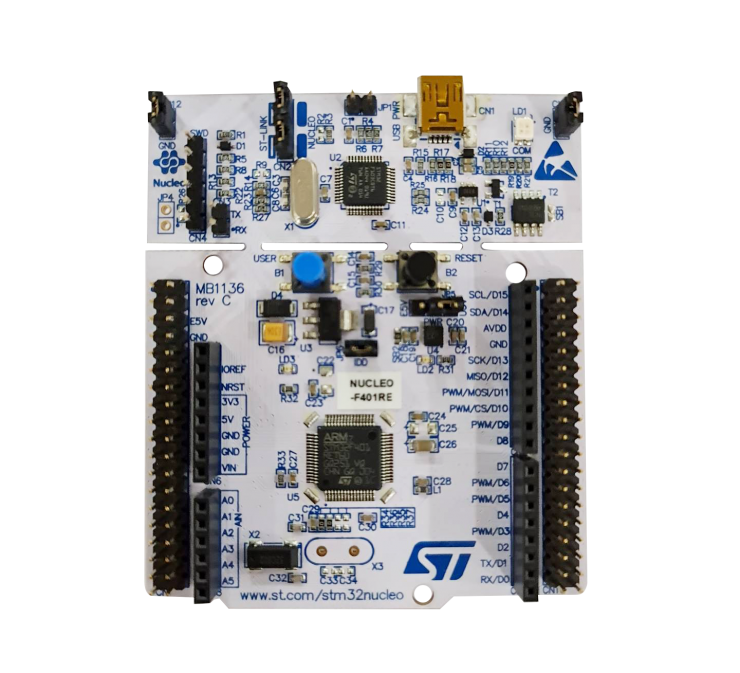

# Embedded software project
This is an embedded software project builded in STM32 Nucleo-64 development board that uses a STM32F401RE MCU.

The project implements the main characteristics like it's powerful memory, Real Time Clock, Analog to Digital Converter and Interrupt Service Routine.

## Development tools
* [C / C++ programming language](https://learn.microsoft.com/en-us/cpp/c-language/?view=msvc-170)
* [STM32CubeIDE](https://www.st.com/en/development-tools/stm32cubeide.html)

## Hardware
* [STM32 Nucleo-64 development board with STM32F401RE MCU](https://www.st.com/en/evaluation-tools/nucleo-f401re.html)

